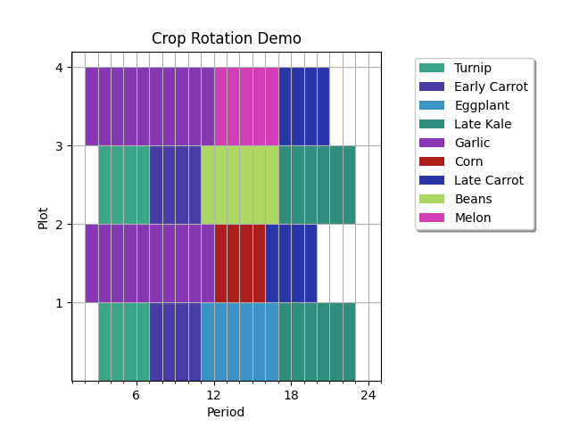
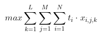
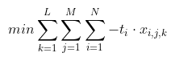
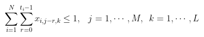
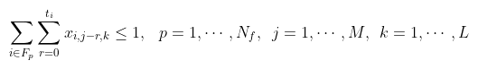
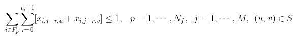
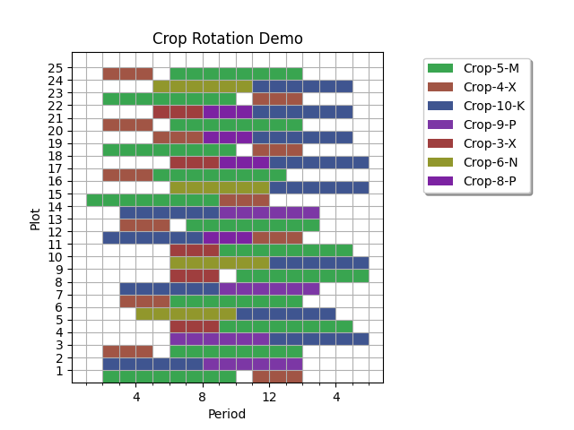

# Crop Rotation

[Crop rotation](https://en.wikipedia.org/wiki/Crop_rotation) is the
agricultural practice of growing a series of different crops in a set of areas,
called plots, over time.  Crop rotation has benefits that include improved soil
structure and reduced dependence on pesticides, herbicides, and fertilizers.

This example demonstrates a means of finding optimal crop rotations for a
set of crops to be planted in a set of plots.  This is done by formulating the
problem as a [discrete quadratic model](
https://docs.ocean.dwavesys.com/en/stable/concepts/dqm.html#dqm-sdk) (DQM) that
can be solved using the D-Wave DQM solver.

## Usage

To run the demo, type:

    python crop_rotation.py

The demo program outputs an optimal crop rotation for a problem instance
defined by a problem file.  By default, the demo program uses the file
`data/problem1.yaml` as problem file.

To solve a different problem instance, type:

    python crop_rotation.py --path <path to your problem file>

The program produces an illustration of the solution such as this:

The plot is saved to `output.png`.

### Generating Problem Instances

To generate random problem instances for testing, type:

    python problem_gen.py NROWS NCOLS

where NROWS and NCOLS provide the dimensions of a 2D plot grid.  The random
problem file is written to stdout.

Additional parameters are described by:

    python problem_gen.py --help

## Code Overview

We frame the problem of crop rotation as a constrained optimization problem
with the objective of maximizing plot utilization.  This problem definition is
based on the formulation described in [Santos et al. (2008)](#santos).

The constraints of the problem are as follows:

Each crop may be planted in any plot, and may be grown zero or more times in a
rotation.  Each crop may be planted only in a certain season, defined as a
range of time units.  Each crop grows for a fixed amount of time before
harvest.  While a crop occupies a plot, no other crop may be planted in that
plot.

A plot can have zero or more adjacent plots.  Crops are members of crop
families.  Crops from the same family may not occupy adjacent plots at the same
time.  Crops from the same family may not occupy a single plot in consecutive
time periods.

### Problem Parameters

These are the parameters of the problem:

- `M` : number of time units in rotation
- `L` : number of plots
- `N` : number of crops
- `N_f` : number of crop families
- `F_p` : set of crops in crop family p
- `S` : set of pairs defining adjacent plots
- `t_i` : number of time units required between planting and harvest for crop i
- `I_i` : range of time [a, b] during which crop i can be planted

### Variables

The problem has `M * L` discrete decision variables, `x_j,k`.  Each has cases
`i ∈ {0, ..., N}`, which indicate that crop `i` is planted in plot `k` at time
`j` (zero signifies no crop is planted).

We can use binary variable `x_i,j,k` to indicate whether crop `i` (or no crop,
where `i` is 0) is assigned to discrete variable `x_j,k`.  We use these
`x_i,j,k` variables in the rest of this document wherever they make the math
easier to follow.

### Occupation

When `x_i,j,k` is 1, crop `i` occupies plot `k` from time `j` to time `j +
t_i`.

### Objective

The objective for the problem can be written as:

<!--
LaTeX equation:
max \sum_{k=1}^{L} \sum_{j=1}^{M} \sum_{i=1}^{N} t_i \cdot x_{i,j,k}
-->

The DQM solver solves minimization problems, so we change this to a
minimization problem by negating the expression.

<!--
LaTeX equation:
min \sum_{k=1}^{L} \sum_{j=1}^{M} \sum_{i=1}^{N} - t_i \cdot x_{i,j,k}
-->

### Constraints

Now we consider our constraints.  The first constraint is that two crops cannot
occupy the same space.  Since our `x_i,j,k` variables indicate planting, not
occupation, we sum the `x_i,j,k` over each crop's grow time `t_i` to represent
occupation.  This is actually a set of constraints; there are `M * L` of them.
They can be written as:

<!--
LaTeX equation:
\sum_{i=1}^{N} \sum_{r=0}^{t_i - 1} x_{i,j - r,k} \leq 1, \hspace{0.3cm}
j = 1, \cdots, M, \hspace{0.2cm} k = 1, \cdots, L
-->

Our second constraint is that two crops from the same family cannot be planted
sequentially in the same plot.  This is also a set of constraints; there are
`N_f * M * L` of them.  They can be written as:

<!--
LaTeX equation:
\sum_{i \in F_p} \sum_{r=0}^{t_i} x_{i,j - r,k} \leq 1, \hspace{0.3cm}
p = 1, \cdots, N_f, \hspace{0.2cm} j = 1, \cdots, M, \hspace{0.2cm}
k = 1, \cdots, L
-->

The third and final constraint is that two crops from the same family cannot be
planted at the same time in adjacent plots.  This is also a set of constraints;
there are `N_f * M * |S|` of them.  They can be written as:

<!--
LaTeX equation:
\sum_{i \in F_p} \sum_{r=0}^{t_i - 1} [ x_{i,j - r,u} + x_{i,j - r,v} ] \leq 1,
\hspace{0.3cm} p = 1, \cdots, N_f, \hspace{0.2cm} j = 1, \cdots, M, \hspace{0.2cm}
(u, v) \in S
-->

### Wrap-around Periods

Crop rotations are cyclic, so the period following `M` is 1.  The constraints
of the problem take wrapping into account.  This is done by substituting
`j - r + M` for `j - r` in the constraint inequalities, whenever `j - r < 1`.

Here is an illustration of a wrapping solution, where `M = 12`:

### DQM Formulation

To formulate the crop rotation problem as a DQM, we want to choose linear and
quadratic biases so that the solution energy will be at a minimum when
utilization is maximized and the problem constraints are satisfied.

The DQM solver solves unconstrained problems, so we use a
[penalty parameter](https://en.wikipedia.org/wiki/Penalty_method) to
relate our constraints to our objective.  We use a single parameter, `gamma`,
as our constraints are equally important.  We choose a value for `gamma` that
is larger than the maximum change in the value of our objective that can be
obtained by changing one variable.  This ensures that our constraints will be
satisfied.  One such value is `1 + max(t_i)`.

Note that the DQM solver allows each variable to have a different number of
cases, or possible values.  To reduce the total number of biases in the
problem, we restrict the cases of the `x_j,k` variables to the set of crops
that can be planted in period `j`, as defined by `I_i`.

### Linear Biases

The linear biases are the negated time values `-t_i`.

### Quadratic Biases

The quadratic, or interaction, biases arise from the constraints.  As all of
our constraints are sums of variables that must equal either 0 or 1, we can use
a simple penalty scheme for each constraint.  That is, we add a positive number
(our penalty parameter, `gamma`) to the quadratic bias for every unique pairing
of the variables that appear in each constraint's sum.

## References

Santos, L. M. R. dos et al. "Crop rotation scheduling with adjacency
constraints." Springer Science+Business Media, LLC, 26 Nov. 2008.

## License

Released under the Apache License 2.0. See [LICENSE](LICENSE) file.

